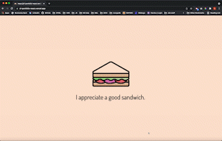

# SL_Portfolio-React

## Deployed Application
https://sl-portfolio-react.vercel.app/

## Description
Portfolio built using React, Javascript and CSS. Includes an 'About Me', 'Projects, 'Resume', and 'Contact' section. Projects page provides links to deployed websites or demos, and to each GitHub repo. Resume page provides downloadable resume and lists technical skills. Contacts page allows viewers to reach out to me. 

## Credits
- Loader page type writing effect: https://css-tricks.com/snippets/css/typewriter-effect/

## License
